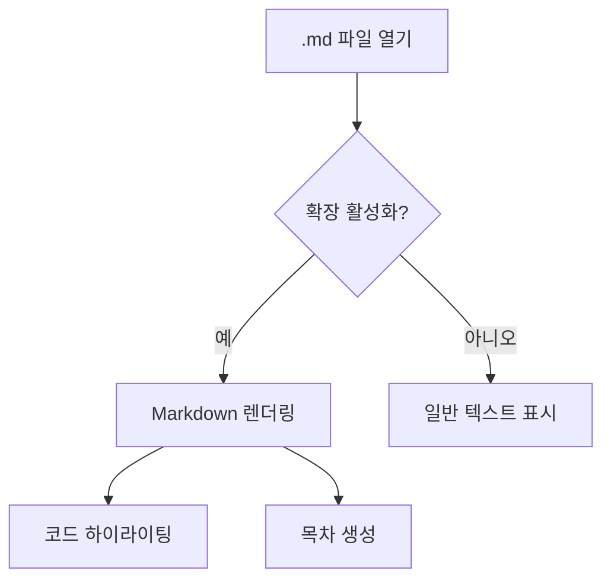
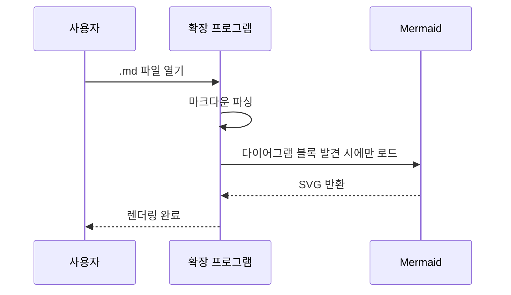

# 🧪 Markdown Viewer 테스트 문서

> 이 문서는 **Markdown Viewer** 확장 프로그램의 렌더링을 테스트하기 위한 샘플 파일입니다.

> [!NOTE]
> 이 문서 맨 위에는 YAML 프론트매터가 있습니다. 렌더링 화면에는 보이지 않아야 정상이며,
> 툴바의 **Raw view**(`</>`) 버튼을 누르면 원본 그대로 확인할 수 있습니다.
> 툴바 첫 번째 버튼(≡)을 누르면 이 문서의 **목차**가 왼쪽에 열립니다.

## 텍스트 서식

일반 텍스트와 **굵은 텍스트**, *기울임 텍스트*, ~~취소선~~ 테스트입니다.
[링크 테스트](https://example.com)도 잘 작동하는지 확인합니다.

`인라인 코드`도 테스트합니다.

## 목록

### 순서 없는 목록
- 첫 번째 항목
- 두 번째 항목
  - 중첩 항목 A
  - 중첩 항목 B
- 세 번째 항목

### 순서 있는 목록
1. 프로젝트 세팅
2. 코드 작성
3. 테스트 및 배포

### 작업 목록 (Task List)
- [x] manifest.json 생성
- [x] Content Script 작성
- [x] CSS 스타일 적용
- [x] 목차 · 알림 블록 · 코드 복사 · Mermaid 추가
- [ ] 크롬 웹 스토어 배포

## 알림 블록 (GitHub Alerts)

> [!NOTE]
> 참고용 정보입니다. 알아두면 유용한 내용을 담습니다.

> [!TIP]
> 더 나은 방법을 제안할 때 사용합니다.

> [!IMPORTANT]
> 목표 달성에 반드시 필요한 정보입니다.

> [!WARNING]
> 주의가 필요한 내용입니다.

> [!CAUTION]
> 위험하거나 되돌릴 수 없는 동작에 대한 경고입니다.

아래는 일반 인용문으로, 알림 블록으로 변환되지 **않아야** 합니다.

> 그냥 평범한 인용문입니다.

## 다이어그램 (Mermaid)





## 코드 블록

> [!TIP]
> 코드 블록에 마우스를 올리면 오른쪽 위에 **Copy** 버튼이 나타납니다.
> 줄 번호는 복사되지 않습니다.

```javascript
// JavaScript 코드 하이라이팅 테스트
function greet(name) {
  const message = `안녕하세요, ${name}님!`;
  console.log(message);
  return message;
}

greet('World');
```

```python
# Python 코드 하이라이팅 테스트
def fibonacci(n):
    a, b = 0, 1
    for _ in range(n):
        yield a
        a, b = b, a + b

for num in fibonacci(10):
    print(num)
```

```bash
# 쉘 스크립트 테스트
echo "Hello from Markdown Viewer!"
npm install
npm run build
```

## 테이블

| 기능 | 상태 | 난이도 |
|------|------|--------|
| Markdown 파싱 | ✅ 완료 | 하 |
| 코드 하이라이팅 | ✅ 완료 | 중 |
| 다크 모드 | ✅ 완료 | 하 |
| 자동 새로고침 | ✅ 완료 | 중 |
| 목차(TOC) 사이드바 | ✅ 완료 | 중 |
| 프론트매터 숨김 | ✅ 완료 | 하 |
| GitHub 알림 블록 | ✅ 완료 | 중 |
| 코드 블록 복사 | ✅ 완료 | 하 |
| Mermaid 다이어그램 | ✅ 완료 | 상 |

## 인용문

> 좋은 소프트웨어는 단순함에서 나옵니다.
> — Unknown

## 수평선

---

## 이미지

이미지는 URL을 통해 로드됩니다:


## 키보드 단축키

<kbd>Ctrl</kbd> + <kbd>Shift</kbd> + <kbd>P</kbd>를 눌러 명령 팔레트를 열 수 있습니다.

---

*Markdown Viewer v1.0.0으로 렌더링됨*
